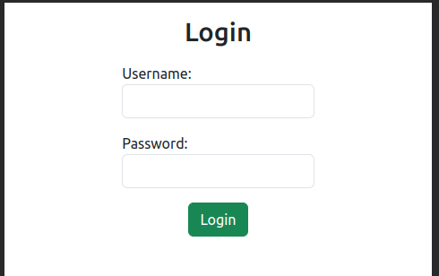
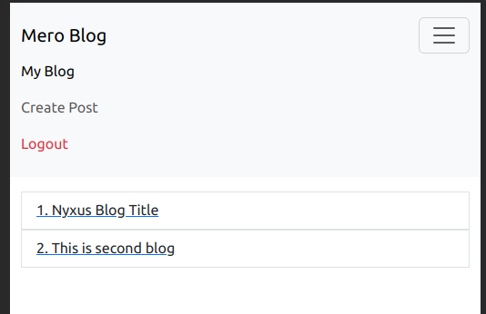
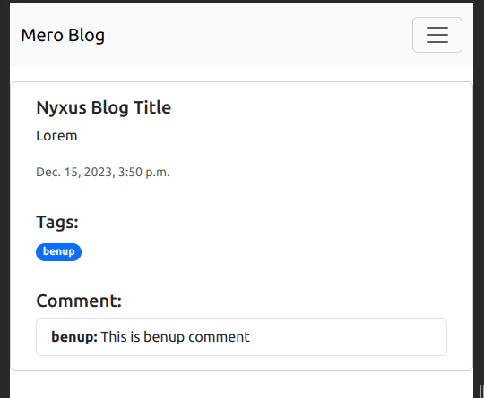
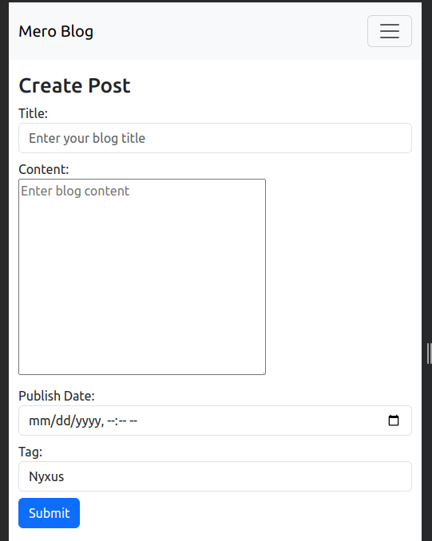

#Mero Blog

run->python3 manage.py runserver
Test User:

login:Nyxus Password:Qwerty@12

login:benup Password:Qwerty@12

superuser:admin password:admin

#Final output:

Login:

User Blog Post:

User Blog Detail:

Create Blog:

